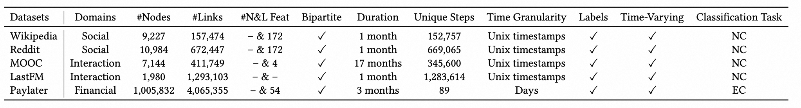
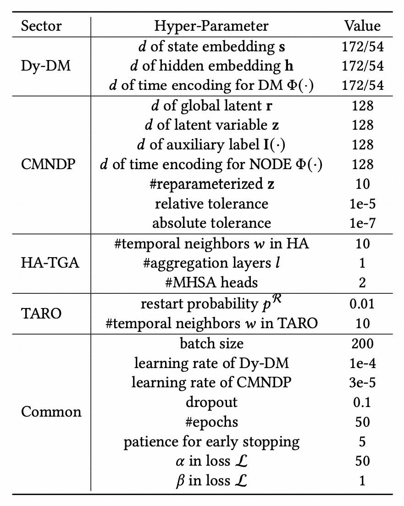

# ICDE2025DyFMVP

Codes for our proposed DyFMVP method.

## Datasets and Preprocessing

Download the public datasets (e.g. Wikipedia) from [SNAP](https://snap.stanford.edu/jodie/), and store the files in folder `data/`. Run the following code
to generate processed files.
~~~
python utils/preprocess_data.py --data wikipedia --bipartite 172
python utils/preprocess_data.py --data paylater --bipartite 54
~~~
The generated files are named as `ml_{}.csv`, `ml_{}.npy`, `ml_{}_node.npy` respectively.

Detailed statistics of four popular public CTDG datasets and one large real-world financial dataset are shown as:


## Environments

~~~
pandas==2.1.4
PyYAML==6.0.1
scikit-learn==1.3.2
scipy==1.11.4
six==1.16.0
torch==1.12.0
torch-scatter==2.1.0+pt112cu113
torchaudio==0.12.0
torchdiffeq==0.2.3
torchvision==0.13.0
tqdm==4.66.1
~~~

## Executing Scripts for Experiments

### Temporal Link Prediction (LP task)

DyFMVP(-TARO):
~~~
python train_self_supervised.py --data [DATA_NAME] --msg_src left --upd_src right --restarter_type taro --restart_prob 0 --prefix [prefix] --subset [CS_ratio] --train_ratio [RS_ratio]
~~~
Default values of `--subset` and `train_ratio` are set to 1.0 as easy split setting.
Argument `--subset` specifies chronological subset sampling ratio, and `train_ratio` specifies random sampling ratio as hard split settings. 

Argument `restart_prob > 0` specifies using restarter on primary model DyFMVP.

### Dynamic Node Classification (NC task)

~~~
python train_supervised.py --code [CODE_GEN_BY_LP] --use_valid --train_ratio [RS/CS_ratio]
~~~
Execute the `train_supervised.py` script for NC task (public datasets, e.g. Wikipedia, MOOC, Reddit) based on LP pretrained model.

Default value of `--train_ratio` is set to 1.0 as easy setting.
Argument `--train_ratio` can specify RS or CS ratio according to sampling choice in codes.

Argument `--code` is a HASH code generated by LP to establish a one-to-one correspondence.

### Dynamic Edge Classification (EC task)

```
python train_supervised_EC.py --code [CODE_GEN_BY_LP] --use_valid --train_ratio [RS/CS_ratio]
```
Execute the `train_supervised_EC.py` script for EC task (e.g. Paylater) based on LP pretrained model.

### Hyper-parameter Configurations

Hyper-parameter configurations of DyFMVP and TARO are shown as:

